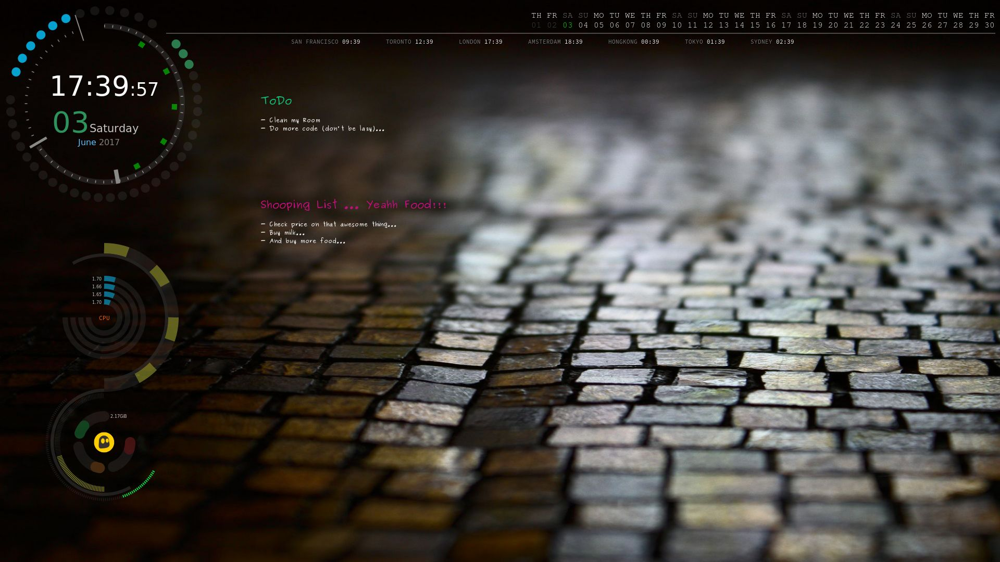

# Conky

Simple Conky done with `Lua` and `Bash`.

## Screenshot

### Usage

Simply run the `start_conky.sh` file.

### Customization

This conky is very customizable.
You can add, remove or change pretty much everything just by editing the `lua_settings.lua` file.
So if you dont like this particular Conky or its color scheme you can completely turn it around to be just as you want it to be.

To do so you can change the variables values on the rings Object, add new Objects or completely remove Objects.
All the key value pairs are explain on the table below.

## Configuration Settings

### Rings

Variable | Explanation
:--------: | -----------
name | Name is the command to be executed by conky. This can also be a empty string for decorative rings.
arg | This is the arguments to the conky command if any. This can also be a empty string.
max | Maximum value for the ring. If your target outpus percentages this should be 100.
bg_color | Background color and opacity (this value goes from 0 to 1) for the ring. eg: `{ '#ffffff', 0.5 }` will be white, half opacity.
fg_color | Foreground color this is the color for the indicator. Works the same as `bg_color`.
range_value | Range values for the indicator to change color. The first value needs to be always 0 (zero). eg: `{0, 40, 70}` will make the indicator color be the first value in the `range_color` when the value is between 0 and 39, the second color when it is between 40 and 69, and the third color when is between 70 and the max value.
range_color | The colors to use for the different values in `range_value`. eg: `{ { '#ffffff', 0.5 }, { '#00ff00', 0.5 }, { '#ff0000', 0.5 } }`.
x | The horizontal coordinate in pixels for the center of the ring. From the top left corner of your Conky window.
y | The vertical coordinate in pixels for the center of the ring. From the top left corner of your Conky window.
radius | The radius of the arc.
thickness | Thickness of the arc line. Remember half of this value goes to the outside of the radius and the other half to the inside.
start_angle | Start angle of the arc in degrees.
end_angle | End angle of the arc in degrees.
gap_percent | This goes from 0 to 1 and it indicates how much of one unit/section out of the max should be drawn. The higher the value the smaller the section of the arc. If this value is 0 (zero) the arc will have no sections.
line_cap | The way the line cap is drawn. Possible values are `CAIRO_LINE_CAP_BUTT`, `CAIRO_LINE_CAP_ROUND` or `CAIRO_LINE_CAP_SQUARE`.

### Text File

Variable | Explanation
:--------: | -----------
path | Path to the text file.
font_family | Font family.
title_size | Font size for the title, if omitted, body size will be used.
title_color | Color for the title, if omitted, body color will be used.
body_size | Font size for the body.
body_color | Color for the body.
x | The horizontal coordinate in pixels.
y | The vertical coordinate in pixels

### Credit Where Credit is Due

Some ideas for the Lua script came from the Clock Rings script from despot77.

You can find the font **SourceCodePro-Medium** from Adobe and installation instructions here:
[https://github.com/adobe-fonts/source-code-pro](https://github.com/adobe-fonts/source-code-pro)

If you need help with Conky you can look at the official repository Wiki here:
[https://github.com/brndnmtthws/conky/wiki](https://github.com/brndnmtthws/conky/wiki)

### A couple more things

For this Conky to work you need: **`Lua`**, **`Cairo`**, **`Imlib2`**, and **`lm-sensors`**.

Possible changes to `lua_settings.lua` file:

If you have a second hard drive change the value of `arg = '/media/Main/'` to the path of your second hard drive or remove this Object completely.
In case you have a different GPU (eg: AMD Graphics Card) you will need to change the values in the NVIDIA section.

### License

See the [LICENSE](LICENSE.md) file for license rights and limitations (MIT).
